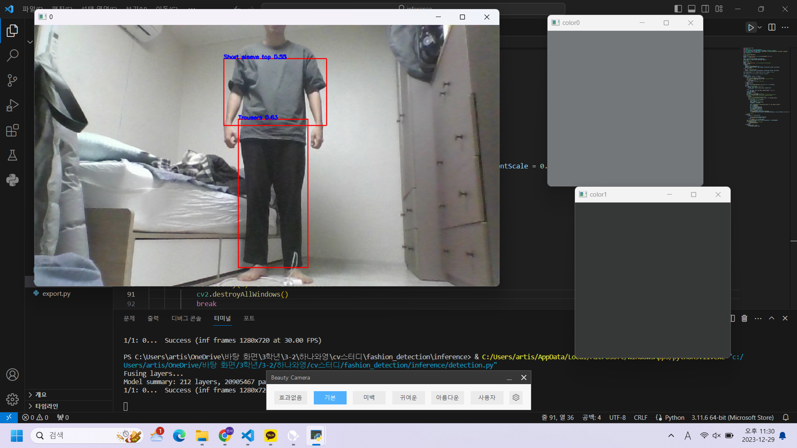

# Fashion Detection
Yolov5 model을 활용한 object detection project

## 과정
전체 traind set의 1/4인 약 50000장을 trainset으로, 전체 validation set의 1/2인 약 16000장을 validation set으로 활용하여 RTX 1060 local 환경에서 약 15시간 가량 학습시켰습니다.

yolov5m.pt를 pretrained weight으로 불러와 imgsize=224, batch=16 으로 학습을 시작했습니다.

yolov5 git에서 제공하는 detection.py를 수정하여 vscode상에서 실행하여 웹캠 화면을 띄울 수 있게 하였습니다.

웹캠에서 찾은 옷 부위만 잘라 k-means를 활용해 주된 색깔을 찾아 네모의 대부분을 차지하는 옷 색생을 검출하였습니다.

## 결과
Long sleeve top, trouser 등 deep fashion2 dataset의 13가지 옷 종류 detection 가능합니다.

현재는 최대 2개 object 까지만 detection하게끔 되어 있지만 코드(detection.py)를 수정하면 여러개도 가능합니다.

찾은 아이템들의 주 색상을 k-means기법을 활용해 찾아 옆에 보여줍니다.

(학습시킨 weight를 용량문제로 업로드 할 수 없어 다운 받으셔도 실행 할 수 없습니다..!)

## 실행방법(weight가 있다는 가정하에):
1. inference 폴더 전체를 다운 받습니다.
   
2. inference 폴더 내의 detection.py를 실행시킵니다.
   
3. 옷을 화면에 대고 잘 나오는지 확인한다.

## 개선 방향
1. dataset전체를 쓰기보다는 사람이 입고있는 모습이 대부분 일 것이므로 사람이 입고있는 사진만 학습 데이터로 활용했더라면 알찬 학습 데이터를 구성할 수 있었을 것이다.
   
2. 좋은 resource로 많은 데이터와 많은 epoch을 돌렸더라면 좋은 모델을 얻을 수 있었을 것이다.

3. 상 하의를 구분하여 색깔 뜨는 위치를 고정해 주면 헷갈릴 일이 적을 것이다.
   
4. 색 조합을 미리 입력해 두어 fashion 점수를 간단하게 매겨줄 수 있게 해도 재밌을 것 같다.
